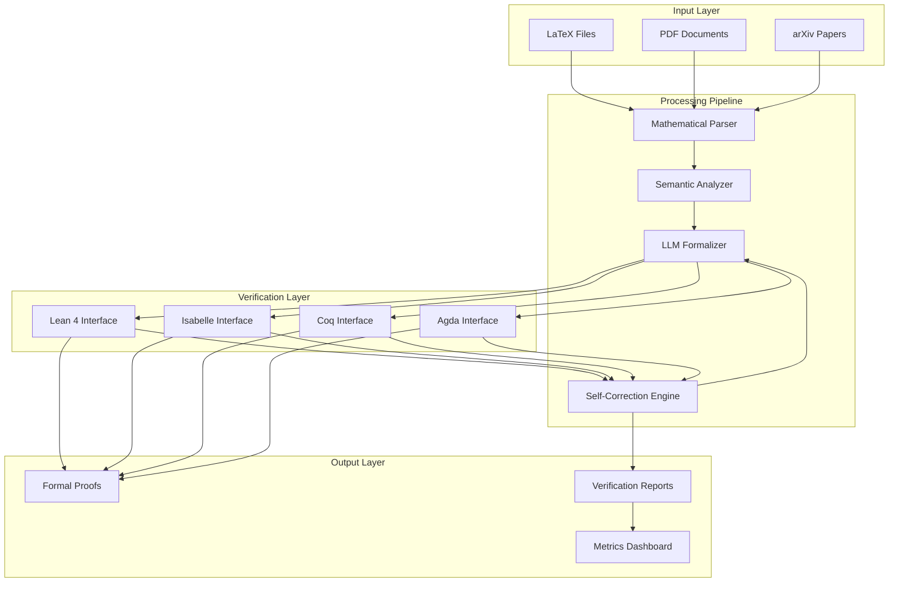

# Architecture Overview

## System Design

**Autoformalize Math Lab** is a multi-layered system designed to bridge informal mathematical writing and formal verification systems through LLM-powered translation and iterative refinement.

## High-Level Architecture

## Core Components

### 1. Mathematical Parser (`src/autoformalize/parsers/`)
- **Purpose**: Extract mathematical content from various input formats
- **Key Classes**: `LaTeXParser`, `PDFParser`, `ArXivParser`
- **Technologies**: PyLaTeX, PyMuPDF, regex, NLTK
- **Output**: Structured mathematical objects (theorems, definitions, proofs)

### 2. Semantic Analyzer (`src/autoformalize/core/`)
- **Purpose**: Understand mathematical concepts and dependencies
- **Key Classes**: `ConceptExtractor`, `DependencyAnalyzer`, `MathlibAligner`
- **Technologies**: Transformers, spaCy, SymPy
- **Output**: Semantic graph of mathematical relationships

### 3. LLM Formalizer (`src/autoformalize/generators/`)
- **Purpose**: Generate formal proof candidates using language models
- **Key Classes**: `Lean4Generator`, `IsabelleGenerator`, `CoqGenerator`
- **Technologies**: OpenAI API, Anthropic API, custom prompts
- **Output**: Formal proof candidates in target languages

### 4. Verification Layer (`src/autoformalize/verifiers/`)
- **Purpose**: Interface with proof assistants for verification
- **Key Classes**: `LeanVerifier`, `IsabelleVerifier`, `CoqVerifier`
- **Technologies**: pexpect, subprocess, custom parsers
- **Output**: Verification results and error messages

### 5. Self-Correction Engine (`src/autoformalize/core/`)
- **Purpose**: Iteratively refine failed proofs using error feedback
- **Key Classes**: `ErrorParser`, `CorrectionGenerator`, `FeedbackLoop`
- **Technologies**: Custom error analysis, prompt engineering
- **Output**: Improved proof candidates

## Data Flow

1. **Input Processing**: Raw mathematical content → Structured objects
2. **Semantic Analysis**: Structured objects → Concept graph
3. **Initial Formalization**: Concept graph → Formal proof candidate
4. **Verification**: Formal proof → Verification result
5. **Error Analysis**: Failed verification → Error classification
6. **Correction**: Error classification → Improved proof candidate
7. **Iteration**: Repeat steps 4-6 until success or max attempts

## Key Design Decisions

### Modular Architecture
- Each component is loosely coupled and independently testable
- Plugin architecture allows adding new proof assistants
- Clear interfaces between parsing, analysis, generation, and verification

### Self-Correction Loop
- Automatic error parsing and correction prompt generation
- Configurable maximum correction rounds
- Human-readable correction explanations for debugging

### Multi-System Support
- Unified interface for different proof assistants
- System-specific generators with shared base classes
- Cross-system translation capabilities

### Scalability Considerations
- Async processing for batch operations
- Redis-based caching for expensive operations
- Horizontal scaling through task queues (Celery)

## Performance Characteristics

### Success Rates by Complexity
- **Elementary**: 85-95% (basic algebra, arithmetic)
- **Intermediate**: 70-85% (calculus, linear algebra)
- **Advanced**: 50-70% (abstract algebra, analysis)
- **Research-level**: 20-40% (novel proofs, complex dependencies)

### Resource Requirements
- **Memory**: 2-8GB RAM (depending on model size)
- **CPU**: 4+ cores recommended for parallel processing
- **Storage**: 10GB+ for models and cache
- **Network**: High bandwidth for LLM API calls

## Security Considerations

### Input Validation
- Sanitize LaTeX input to prevent injection attacks
- Validate file uploads and limit file sizes
- Timeout mechanisms for long-running processes

### API Security
- Rate limiting for LLM API calls
- API key rotation and secure storage
- Request/response logging with PII filtering

### Proof Assistant Isolation
- Sandboxed execution environments
- Resource limits for verification processes
- Secure temporary file handling

## Monitoring and Observability

### Metrics Collection
- Success rates by mathematical domain
- Average correction rounds per proof
- Performance metrics (latency, throughput)
- Resource utilization (CPU, memory, API calls)

### Health Checks
- Proof assistant availability
- LLM API connectivity
- Database connection status
- Cache system health

### Alerting
- High error rates or unusual patterns
- API rate limit approaching
- System resource exhaustion
- Security anomalies

## Future Architecture Considerations

### Planned Enhancements
- Multi-agent collaboration for complex proofs
- Fine-tuned models for mathematical domains
- Integration with theorem databases (OEIS, etc.)
- Real-time collaboration features

### Scalability Roadmap
- Kubernetes deployment for cloud scaling
- Model serving optimization (quantization, caching)
- Distributed proof search algorithms
- Edge computing for low-latency applications