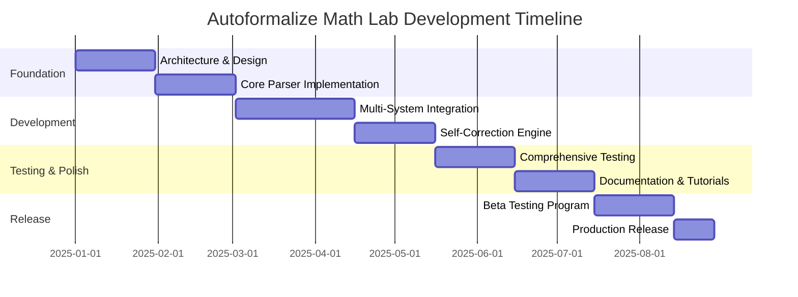

# Project Charter: Autoformalize Math Lab

## Project Overview

**Project Name**: Autoformalize Math Lab  
**Project Type**: Open Source Research Tool  
**Start Date**: January 2025  
**Initial Release Target**: June 2025  
**Project Sponsor**: Research Community  
**Project Manager**: [To be assigned]  

## Problem Statement

The mathematical community faces a significant formalization gap:
- Only 3% of published mathematics is formally verified
- Manual formalization is 10-100x slower than proof writing
- No standardized tools exist for automated proof formalization
- High barrier to entry for formal verification methods

## Project Purpose and Justification

### Purpose
Create an industrial-strength, LLM-powered system that automatically converts informal mathematical proofs (LaTeX, PDF) into formally verified code for major proof assistants (Lean 4, Isabelle, Coq).

### Business Justification
- **Research Acceleration**: Reduce time from mathematical discovery to formal verification from months to hours
- **Educational Impact**: Make formal mathematics accessible to undergraduate students
- **Quality Assurance**: Enable automatic verification of mathematical publications
- **Open Science**: Democratize access to formal verification tools

## Scope Definition

### In Scope
- **Input Formats**: LaTeX documents, PDF papers, arXiv submissions
- **Target Systems**: Lean 4, Isabelle/HOL, Coq, Agda
- **Mathematical Domains**: Undergraduate and graduate level mathematics
- **Self-Correction**: Iterative refinement using proof assistant feedback
- **Performance Metrics**: Success rate tracking and benchmarking
- **Documentation**: Comprehensive user and developer guides
- **Open Source**: MIT licensed, community-driven development

### Out of Scope (v1.0)
- Proprietary/commercial proof assistants
- Research-level automated theorem proving
- Natural language proof generation
- Real-time collaborative editing (planned for v2.0)
- Mobile applications (planned for future versions)

## Objectives and Success Criteria

### Primary Objectives
1. **High Success Rate**: 80%+ success on undergraduate mathematics, 60%+ on graduate level
2. **Multi-System Support**: Equal quality across Lean 4, Isabelle, and Coq
3. **Self-Correction**: Average <3 correction rounds for successful proofs
4. **Performance**: Process typical problems in <60 seconds
5. **Usability**: CLI and programmatic API with comprehensive documentation

### Success Criteria

#### Technical Success
- [ ] Benchmark success rates exceed 80% on curated undergraduate dataset
- [ ] Processing time averages under 60 seconds for standard problems
- [ ] Self-correction mechanism reduces manual intervention by 90%+
- [ ] Support for 10+ major mathematical domains
- [ ] 95%+ uptime in production deployment

#### Community Success
- [ ] 1000+ active users within 6 months of release
- [ ] 100+ GitHub stars and 50+ contributors
- [ ] Integration with 10+ educational institutions
- [ ] 5+ published papers citing the tool
- [ ] Active community forums and documentation

#### Impact Success
- [ ] 10,000+ mathematical theorems successfully formalized
- [ ] Measurable reduction in formalization time for partner institutions
- [ ] Adoption by at least one major mathematical journal
- [ ] Successful processing of complete research papers
- [ ] Recognition from formal methods community

## Stakeholders

### Primary Stakeholders
- **Mathematics Researchers**: Primary users for research formalization
- **Educators**: Use for teaching formal methods and verification
- **Students**: Learn formal mathematics and verification techniques
- **Proof Assistant Communities**: Lean, Isabelle, Coq developers and users

### Secondary Stakeholders
- **Academic Institutions**: Departments adopting formal verification
- **Publishers**: Mathematical journals considering formal verification
- **Industry**: Companies using formal methods for verification
- **Open Source Community**: Contributors and maintainers

### Stakeholder Expectations
- **Researchers**: Reliable, accurate formalization with minimal manual intervention
- **Educators**: Easy-to-use tools with good educational materials
- **Students**: Gentle learning curve with comprehensive tutorials
- **Community**: Open development process with responsive maintainership

## High-Level Requirements

### Functional Requirements
1. **Input Processing**: Parse LaTeX, PDF, and arXiv papers accurately
2. **Mathematical Analysis**: Extract theorems, definitions, and proofs
3. **Formalization**: Generate syntactically correct formal proofs
4. **Verification**: Interface with proof assistants for validation
5. **Self-Correction**: Automatically fix common errors using feedback
6. **Multi-System**: Support multiple proof assistant targets
7. **Performance Tracking**: Monitor and report success metrics

### Non-Functional Requirements
1. **Performance**: Sub-minute processing for typical problems
2. **Reliability**: 99%+ uptime for core services
3. **Scalability**: Handle concurrent users and batch processing
4. **Security**: Secure API access and data handling
5. **Maintainability**: Well-documented, modular codebase
6. **Usability**: Clear CLI interface and comprehensive documentation
7. **Portability**: Cross-platform support (Linux, macOS, Windows)

## Major Deliverables

### Phase 1: Foundation (Months 1-2)
- [ ] Core architecture and modular design
- [ ] Basic LaTeX parser and mathematical content extraction
- [ ] Initial Lean 4 integration and verification
- [ ] CLI interface with essential commands
- [ ] Unit testing framework and initial test suite

### Phase 2: Multi-System Support (Months 3-4)
- [ ] Isabelle and Coq integration
- [ ] Self-correction mechanism implementation
- [ ] Enhanced mathematical domain support
- [ ] Performance optimization and caching
- [ ] Integration testing and benchmarking

### Phase 3: Production Readiness (Months 5-6)
- [ ] Comprehensive documentation and tutorials
- [ ] CI/CD pipeline and automated testing
- [ ] Production deployment and monitoring
- [ ] Community onboarding and contribution guidelines
- [ ] Beta testing program with academic partners

## High-Level Timeline

## Budget and Resources

### Development Resources
- **Core Team**: 2-3 full-time developers
- **Domain Experts**: 1-2 mathematical consultants
- **DevOps**: 1 part-time infrastructure specialist
- **Community**: Open source contributors (estimated 10-20 active)

### Infrastructure Costs (Annual)
- **Cloud Computing**: $5,000 (AWS/GCP for CI/CD and hosting)
- **LLM API Costs**: $10,000 (OpenAI, Anthropic for development/testing)
- **Monitoring/Analytics**: $1,000 (logging, metrics, error tracking)
- **Documentation Hosting**: $500 (ReadTheDocs, GitHub Pages)

### Total Estimated Budget: $50,000 - $75,000 (first year)

## Risk Assessment

### High-Risk Items
1. **LLM Reliability**: Variable quality of generated proofs
   - *Mitigation*: Robust self-correction and human feedback loops
2. **Proof Assistant Complexity**: Integration challenges with multiple systems
   - *Mitigation*: Modular architecture and expert consultation
3. **Performance Scalability**: Handling large documents and batch processing
   - *Mitigation*: Efficient algorithms and cloud infrastructure

### Medium-Risk Items
1. **Community Adoption**: Slow uptake by target users
   - *Mitigation*: Strong documentation and educational outreach
2. **Mathematical Coverage**: Limited success on complex domains
   - *Mitigation*: Iterative improvement and domain-specific optimization

### Low-Risk Items
1. **Technical Implementation**: Standard software development challenges
2. **Open Source Management**: Community contribution coordination

## Communication Plan

### Internal Communication
- **Weekly**: Development team standups
- **Bi-weekly**: Stakeholder progress updates
- **Monthly**: Community advisory board meetings
- **Quarterly**: Major milestone reviews and roadmap updates

### External Communication
- **GitHub**: Primary development and issue tracking
- **Documentation**: Comprehensive guides and API references
- **Blog**: Regular progress updates and technical deep-dives
- **Conferences**: Presentations at mathematical and formal methods conferences
- **Social Media**: Twitter/LinkedIn for community engagement

## Approval and Sign-off

This project charter establishes the foundation for the Autoformalize Math Lab project. Approval indicates agreement with the scope, objectives, timeline, and resource requirements outlined above.

**Project Sponsor**: _________________ Date: _________

**Technical Lead**: _________________ Date: _________

**Community Representative**: _________________ Date: _________

---

*Document Version*: 1.0  
*Last Updated*: February 2025  
*Next Review*: May 2025